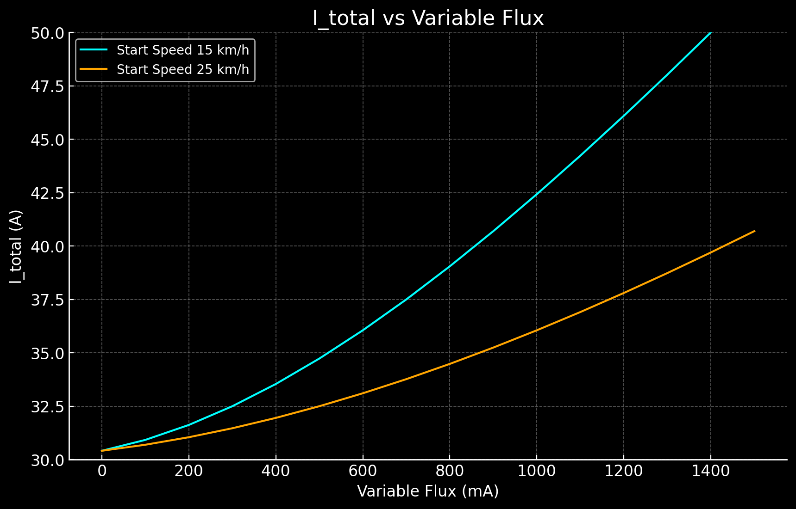
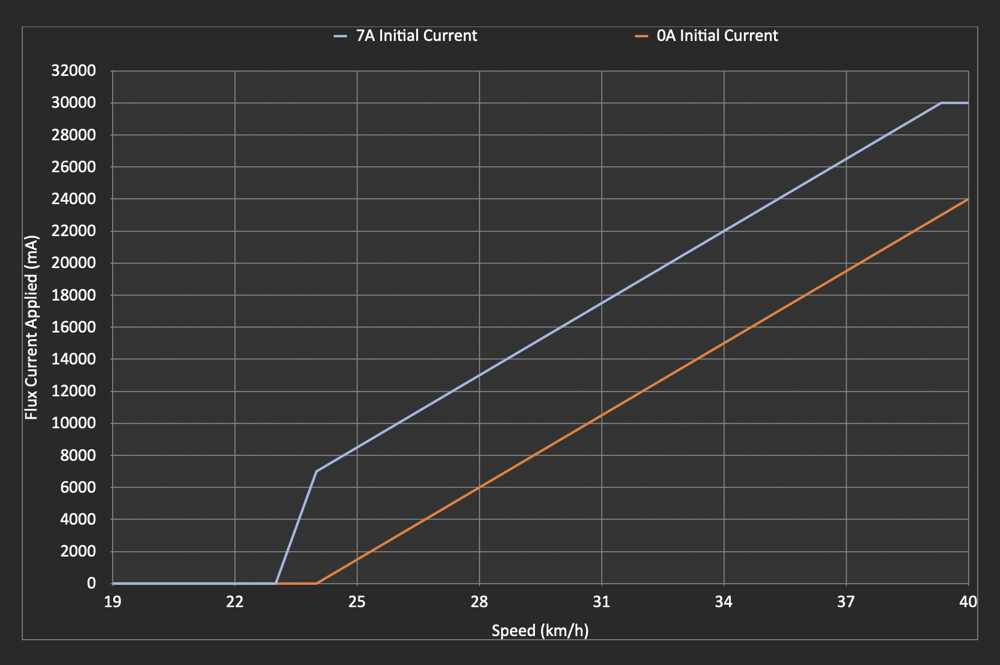

## Quick SHFW Configuration Walkthrough

## SHFW 3.7.1 is out, go test it out!

For a detailed list of new features and improvements in SHFW 3.7.1, see the [3.7.1 Changelog](#371-changelog).

SHFW is a custom firmware available for flashing via the Scooterhacking Utility app. Configuring it might be challenging for new users. This guide aims to provide a quick and easy way to apply the important basics. The understanding aspect of all this can be overwhelming, but it will come as a side effect of your own testing and thinking as we can't do that for you.

- [Quick SHFW Configuration Walkthrough](#quick-shfw-configuration-walkthrough)
  - [Installation](#installation)
  - [Usage](#usage)
    - [Peak Current Draw Calculator Features](#peak-current-draw-calculator-features)
    - [Ninebot G30](#ninebot-g30)
    - [Xiaomi Pro 2, 3](#xiaomi-pro-2-3)
    - [Xiaomi Essential, Lite, 1S](#xiaomi-essential-lite-1s)
  - [Field Weakening Calculations and Logic](#field-weakening-calculations-and-logic)
    - [What is Field Weakening?](#what-is-field-weakening)
    - [Field Weakening Flux Calculation](#field-weakening-flux-calculation)
  - [Custom batteries and BMS emulation](#custom-batteries-and-bms-emulation)
    - [ADC modding info (G30)](#adc-modding-info-g30)
- [License](#license)
- [Author Information](#author-information)

### Installation

To install SHFW, follow these steps:

1. Download the flashing app from [https://utility.cfw.sh/](https://utility.cfw.sh/).

2. Supported Scooter Models:

   - **Ninebot G30**: You can flash this firmware if the DRV version is at 1.7.0 or below. If your DRV is above 1.7.0 and not higher than 1.7.3, you need to select "Attempt Downgrade". For DRV versions above 1.7.3, you'll need an ST-link. Refer to [this](https://joeybabcock.me/wiki/STLink_Ninebot_Max_ESC) for more information.

   - **Xiaomi Scooters**: If the BLE version is at or above 1.5.0, you'll need an ST-link for the dashboard. There are online guides available for this process.

   - **Ninebot EsX and Ex Series**: You can flash this firmware if the DRV version is below 2.7.0. Else you will need to use a st-link. There are online guides available for this process.

   - **Ninebot F-Series**: You can flash this firmware if the DRV version is below 5.7.0. Else you will need to use a st-link. There are online guides available for this process.

   - **Ninebot D-Series**: There is an experimental support for D-Series using the F-Series firmware. It's not known at which DRV version you will need a St-link. The guides should be identical to the F-Series.

| Model | Compatible BLE | Compatible DRV |
|:--|:--|:--|
|  | *ST-link if incompatible* | *ST-link if incompatible* |
| Ninebot G30 | All | Up to 1.7.3 [info](https://joeybabcock.me/wiki/STLink_Ninebot_Max_ESC) |
| Ninebot G2 | All | ST-link, for patched stock firmware |
| Ninebot F2-Series | N/A | N/A |
| Xiaomi Essential, 1s, mi3 | Below 1.5.5 | All, (mi3 below 0.1.6) |
| Ninebot EsX and Ex Series | All | Below 2.7.0 |
| Ninebot F-Series | All | Below 5.7.0 |
| Ninebot D-Series | All  | Experimental (F-Series firmware, unknown) |

3. Flash Procedure:

   - Ensure you have the correct scooter model.
   - Open the utility app, connect to the scooter.
   - Press "Install/update SHFW" and select a version of the highest number.If there's only one, select that.
      - If you have the new G30 motor then select the new motor option under the system config tab as well.
      - Enable "expert view" on the top right.
   
   **Note**: If BLE/DRV is low enough to be supported, but fails to flash, then press "Attempt DRV downgrade" and press flash.

### Usage

Please be aware that the information provided below is intended for practical use, but it should be used with caution. Remember, field weakening, because of its nature, will not be efficient.

#### Peak Current Draw Calculator Features

- **Torque Amps Calculation**: Users can input their torque amps (Iq) to calculate the torque component accurately.
- **Field Weakening Calculation**: By entering the initial flux in A, variable flux in mAh, current max speed in km/h, and start speed in km/h, the calculator determines the flux component (Id), incorporating field weakening effects.
- **Peak Current Draw**: With the input parameters, the calculator computes the peak current draw (I_total), providing essential insights into the system's maximum electrical demand.

To customize these phase limits, check out the Iq and Id sliders under "Field Weakening".

[**Try the Peak Current Draw Calculator**](https://lekrsu.github.io/shfw-walkthrough/logic/index.html) - A user-friendly tool designed for clarity and efficiency in calculating electrical parameters. Keep in mind, this is peak, not showing actual real life battery draw, but it helps visualize it.

  
  
Graph showing Torque 30A, initial 5A flux, with 100mA increments of variable flux, from the speeds 15 km/h and 25 km/h.

## 3.7.1 changelog

### PWM Frequency Adjustment
- **Range:** 4-24kHz
- **Effects:** Modifies motor frequency, impacting sound and vibrations. Higher frequencies may result in slight losses, but these are generally minimal.

### Acceleration Boost
- **Purpose:** Enhances torque delivery at low RPMs.
- **Setting:** Slider can be adjusted up to 100%.
- **Recommendation:** It's advisable to set the slider to 100% for improved performance.

### Brake Boost
- **Purpose:** Increases the aggressiveness of the electronic brake.
- **Range:** Adjustable from 0 to 100.
- **Effect:** Significantly enhances braking force.
- **Recommendation:** Adjust according to desired braking response.

### Amps Display on Dash
- **Modes:**
  - **Battery Amps:** Displayed when BMS communications is plugged in.
  - **Phase Amps:** Shown when using battery emulation (only in apps like Scootbatt).
  - **Approximated Phase Amps:** Done when both emulation and flux measurement are utilized (only in apps like Scootbatt).
- **Recommendation:** Select the display mode based on the configuration and diagnostic needs.

### Id/Iq Control Sliders
- **Purpose:** Allows for the adjustment of maximum phase limits for torque (Id) and flux (Iq).
- **Recommendation:** Modify these settings if there is a need to customize torque and flux limits.

For further details and troubleshooting, refer to the subsequent sections of this guide or contact support.

#### [Ninebot G30](#ninebot-g30)

To achieve the top speed for Ninebot G30, follow these configurations:

1. Set sport DPC curve to 30A with a flat curve (0.5 quadratic).
   - Configure the other modes as desired, preferably lower than sport for logical reasons.
   - Keep the speed limit to off / 0.
   - Acceleration boost, 100%.
   - Brake boost, 50%.

2. Go to the field weakening tab and:
   - Enable field weakening for sport mode.
   - Configure as follows: 20 km/h, 5A, 1500.

3. Default tire size for G30 models are 10", but set 9.3" to get the dash speed to match GPS speed.

4. Under Motor Settings, select 20 or 24khz.

Additional information: Newer G30 BMS models might run firmware limited to 28A total battery current. These, will have worse performance compared to the older 40A current models.

#### [Xiaomi Pro 2, 3](#xiaomi-pro-2-3)

For Xiaomi Pro 2 and mi3, use the following configurations:

1. Sport mode, DPC, 25A, flat curve (0.5 quadratic).
   - Acceleration boost, 50%.
   - Brake boost, 0-100%, up to you, be aware that it's stong.

2. Go to the field weakening tab and:
   - Enable field weakening for sport mode.
   - Configure as follows: 20 km/h, 5A, 1500.

4. Under Motor Settings, select 20 or 24khz.

#### [Xiaomi Essential, Lite, 1S](#xiaomi-essential-lite-1s)

For Xiaomi Essential Lite, use these configurations:

1. Sport mode, DPC, 18A, flat curve (0.5 quadratic).
   - Acceleration boost, 50%.
   - Brake boost, 0-100%, up to you, be aware that it's stong.
  
2. Go to the field weakening tab and:
   - Enable field weakening for sport mode.
   - Configure as follows: 15 km/h, 0A, 1500.

4. Under Motor Settings, select 20 or 24khz.

## Explanation of PI Control and Acceleration Boost

### PI Control for Voltage Time Conversion

The PI control system converts amperes into voltage time. This process scales the voltage time from 0 to 31128, where 31128 represents 100%. This scaling is done for both current components. If the total time exceeds 31128, the values are adjusted down to a new value accordingly.

### Voltage Measurement and Compensation

The system measures only the voltage time, using a 100% duty cycle at maximum potential speed. This method allows the system to perform consistently at different voltages without requiring firmware adjustments. The PWM (Pulse Width Modulation) cycle is kept high continuously, operating similarly to a DC engine.

### Implementation Specifics

- **16-bit Counters:** The system uses 16-bit counters to implement PWM. The counters stop 4 loops before the end of the frequency.
- **Duty Cycle Limit:** The duty cycle is limited to 95%, as achieving 100% is theoretically possible but impractical.
- **Voltage Relevance:** Voltage is not directly relevant for control. Instead, the control manages the phase duration. For example:
  - Phase A might be high for 10 ms
  - Phase B might be high for 5 ms
  - Phase C might be high for a shorter duration

However, it is important to note that the actual phase times are much shorter than these examples.

### Acceleration Boost

To explain the acceleration boost, let's consider an example involving the existing PI control. The goal is to manipulate the control's behavior without changing its parameters.

In this example, the target current is initially set higher, increasing from 40A to 60A temporarily. Before the control reaches 40A, the target is reset back to 40A. This approach enables the motor to respond more quickly without requiring more current permanently. However, this causes the proportional component to increase, leading to higher electricity consumption. The extra energy needed for this acceleration must be sourced from somewhere.

### Field Weakening Calculations and Logic

#### What is Field Weakening?

Field weakening is a technique commonly used with 3-phase electric motors to achieve higher speeds in electric vehicles like scooters. It allows the motor to operate beyond its rated voltage and rpm, which can result in increased top speed. However, implementing field weakening comes with trade-offs, including increased battery usage, higher motor temperatures, and potential additional expenses.

#### Field Weakening Flux Calculation

The calculation for field weakening flux is as follows:

field weakening flux = initial + ("current speed" - "field weakening start speed") * (variable / 1000)

- `initial`: The initial value of the field weakening flux.
- `"current speed"`: The current speed of the scooter.
- `"field weakening start speed"`: The speed at which field weakening should start.
- `variable`: A parameter that influences the rate of flux increase.

Here's a graph of the flux current applied at various speeds comparing the following 2 setups:
- 7A initial current, 24km/h start speed, 1500mA/km/h variable current
- 0A initial current, 24km/h start speed, 1500mA/km/h variable current

<!--  -->

  

### Custom batteries and BMS emulation

After installing a custom battery in specific scooter models, you might notice that the display no longer shows the battery charge percentage. This occurs because the scooter's original Battery Management System (BMS) uses a communication cable to provide this information, among other functions. As a workaround, BMS emulation can be employed. This method calculates the battery's charge level based purely on the system's voltage, a viable approach due to the linear relationship between voltage and charge state.

For configuration, access the Utility app and navigate to the 'Config' tab. Here, you will find the BMS emulation option towards the bottom. In this section, enter the details of your battery, including the number of series groups and the total capacity. It's crucial to ensure the minimum and maximum cell group voltages are set correctly, ideally matching or being more conservative than those specified by your BMS. The voltage range for a Li-Ion cell typically spans from 3 to 4.2V, but your BMS may have specific cutoff limits for charging and discharging. Adjust these settings according to your BMS's limits or opt for the default if uncertain.

Note, BMS emulation is necessary only if you've completely replaced the original battery. If you've added an additional pack in series with matching or higher capacity, or if you have another battery in parallel, BMS emulation is not required. In cases of parallel battery configurations, the primary adjustment needed is to disable the charging mode, which can be found in the system settings. This guide aims to facilitate a seamless transition to custom battery usage, ensuring optimal performance and compatibility.

Given:
- `V_min` = Minimum voltage of the battery pack when fully discharged.
- `V_max` = Maximum voltage of the battery pack when fully charged.
- `V_current` = Current voltage of the battery pack.

The formula to calculate the battery percentage (`Battery_%`) is:

Battery_% = ((V_current - V_min) / (V_max - V_min)) * 100

Where:
- `Battery_%` is the state of charge of the battery pack as a percentage.
- `V_min` is the total voltage of the pack when all cells are at their minimum voltage.
- `V_max` is the total voltage of the pack when all cells are at their maximum voltage.
- `V_current` is the current total voltage of the battery pack.

  
  
Example of what I_total of 42A actually looks on a flat road while requesting 30A torque, 30A flux.

#### ADC modding info (G30 & ESx)

Special thanks to BXLR for providing valuable information on the R_adc logic.

[Open Calculator](https://lekrsu.github.io/shfw-walkthrough/calculator/)

**Note1**: Make sure to adjust R_adc, as it plays a significant role in ADC modding.
**Note2**: You can also measure your battery voltage and then increase the divider voltage until the system voltage reading matches your previous meassuring.
**Note3**: You only need to touch this setting once you changed the resistors on the esc. 

### License

This project is licensed under the [MIT License](LICENSE).

Please review the [LICENSE](LICENSE) file for detailed terms and conditions.

**Note**: The MIT License is applied to this project. While it allows for wide use and modification, it comes with no warranties or guarantees. The project contributors and maintainers are not responsible for any issues, damages, or liabilities that may arise from the use of this software.

### Author Information

This guide has been written by **lekrsu**, who can be reached on Discord with the tag `lekrsu` and on Telegram with the username `lekrsu`. You're welcome to send a pull request if you feel like the information needs correction.
