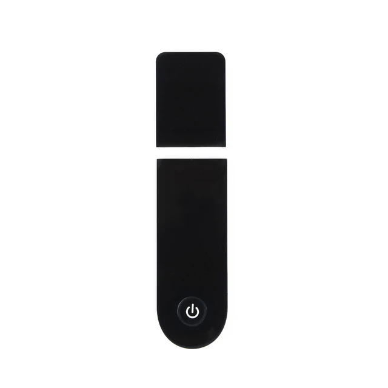
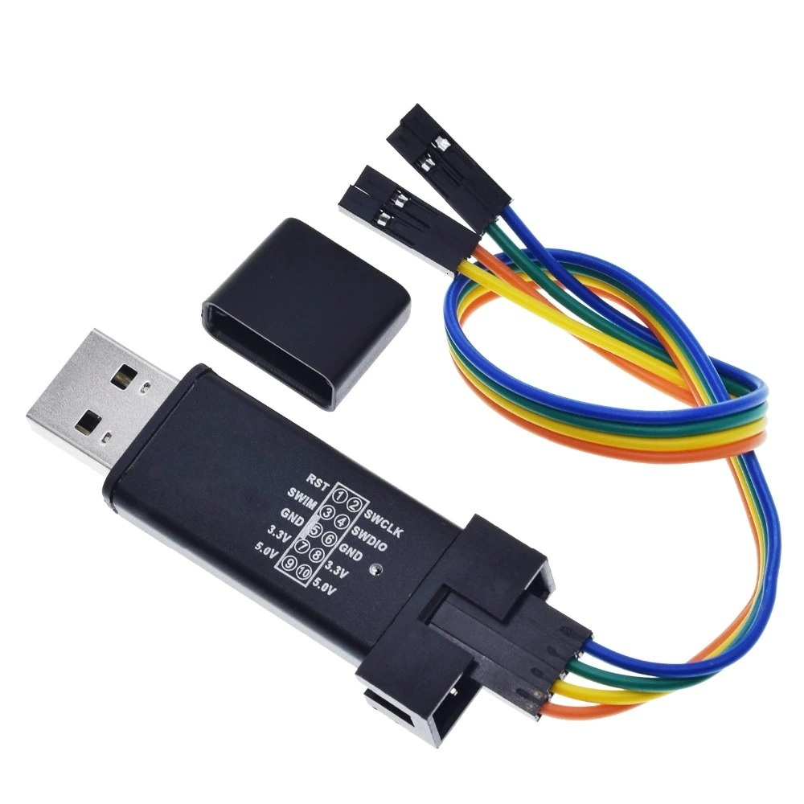
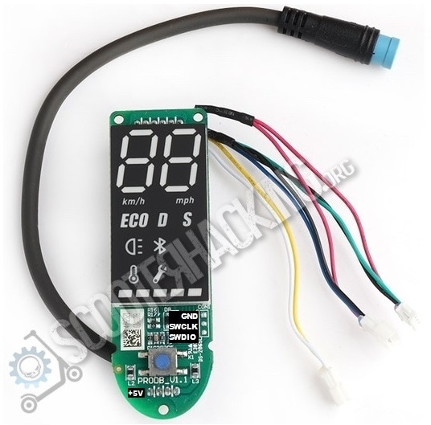
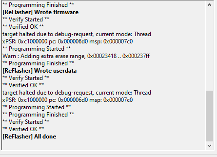

# Xiaomi BLE Reflashing Guide

## Introduction
This guide will walk you through the process of reflashing the BLE module on your Xiaomi device. Please follow the instructions carefully and refer to the images provided for clarity.

## Required Tools
- ST-Link V2
- Male to Female Dupont cables
- Knife or a similar tool for scraping
- Windows PC for running Reflasher

## Steps

### 1. Preparation
1. **Remove the dash cover**: Begin by taking off the dash cover to access the dash.
 
   
   
2. **Gather all required tools**: Ensure you have an ST-Link V2, male to female Dupont cables, and a Windows PC.
 
   
   
   
   
3. **Download the reflasher tool**: [Download the reflasher tool from ScooterHacking](https://www.scooterhacking.org/forum/viewtopic.php?t=676).

### 2. Connecting the Hardware
1. **Scrape the coating on the BLE debug pads**: The BLE module has a slight coating on its debug pads. Use a knife or anything else and gently scrape away the coating to ensure a good contact.

      
      

2. **Attach Dupont cables to the BLE module**: Bend the pins inward so that they can physically touch the pads. Secure the connection by taping the ends together side by side and hold the pins in place when flashing.
3. **Turn on the dash**: When ready to flash, ensure the dash is turned on. If the dash does not turn on, remove it completely and supply 5V as shown in the images.

### 3. Flashing the Firmware
1. **Run the reflasher tool**: Open the reflasher tool on your Windows PC. Ensure the console is visible so you can monitor the process.
2. **Start the flashing process**: Hold the three pins in place on the BLE module and press the start button in the reflasher tool. It may take a few tries to get it right.
3. **Monitor the reflasher console**: Watch the console output. It will indicate when the process is complete with a message saying "All done".
   
   

### 4. Troubleshooting
- **If the dash does not turn on**: Ensure the BLE module is properly connected and the debug pads are making contact. Try supplying 5V directly if necessary.

## Conclusion
By following these steps, you should be able to successfully reflash your Xiaomi BLE module. Ensure all connections are secure and retry the process if you encounter any issues.
